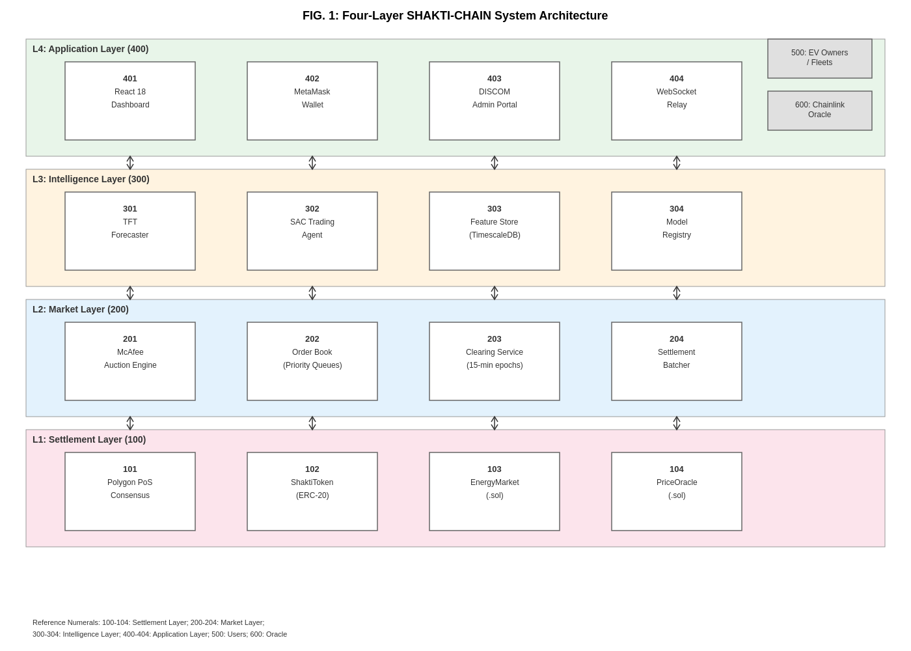

# Shakti-Chain

**A vehicle-to-grid energy marketplace with a McAfee double auction and Layer-2 settlement.**

BITS Pilani · Computer Science & Information Systems · Electrical & Electronics Engineering

Shakti-Chain lets electric-vehicle owners, fleets, and buyers trade energy in 15-minute rounds. Clearing uses a McAfee double auction, so truthful per-unit price reporting is a dominant strategy, no matched participant loses money, and the operator does not require an external subsidy. Settlement uses an ERC-20 token on Polygon with a mint-on-delivery, burn-on-redemption lifecycle that holds a 1:1 kWh peg.

This repository is the working demonstration of that design. It is **BITS Pilani intellectual property**, not open-source software. An Indian patent application has been filed. See [LICENSE](LICENSE) and [NOTICE.md](NOTICE.md).

---

## Why this exists

India’s FAME programme targets 30% EV penetration by 2030: on the order of 50 million battery-equipped vehicles and roughly 300 GWh of distributed storage. Peak demand is projected above 340 GW in the same period. Bidirectional inverters and smart meters already exist at pilot scale. What is missing is a settlement and price-discovery layer that can clear high-frequency, low-value V2G trades without a trusted intermediary and without a platform subsidy.

Retail rails such as UPI batch slowly and take a large share of a typical ₹15–40 discharge event. Layer-1 Ethereum settlement is too expensive for the same trades. Fixed DISCOM tariffs do not elicit truthful bids. Shakti-Chain is built for that gap.

## What industry visitors get

| Surface | Where |
|---|---|
| This repository | https://github.com/amitduabits/shaktichain |
| Working marketplace demo | See [DEMO.md](DEMO.md) — login page, **Enter Demo**, no wallet required |
| API | FastAPI + OpenAPI at `/docs` once the backend is running |
| Smart contracts | [`shakti-contracts/`](shakti-contracts/) |
| Experiment harness | [`experiments/`](experiments/) |

A live hosted demo is available from the investigators on request. The application itself is already running as a local/demo deployment.

## Measured results (simulation)

Numbers below are from a pre-registered 2,000-agent evaluation calibrated to POSOCO load data for Delhi, Mumbai, Bangalore, Chennai, and Kolkata. They are **simulation measurements**, not a live-grid trial.

| Quantity | Result | Status |
|---|---|---|
| Allocative efficiency | 97.3% | Measured vs welfare-maximising uniform-price benchmark |
| Gross participant ROI vs time-of-use | 18.7% (about 10–13% post-tax under current VDA rules) | Measured |
| kWh peg deviation | 0.007% over 3,000 redemption events | Measured |
| Feeder hosting-capacity wrapper | Curtails 0.16% of cleared welfare on average | Measured |
| Coalition surplus (5 agents) | 12.3% excess | Failed the 10% pre-registered threshold; expected under budget-balanced DSIC mechanisms |

Formal properties of the McAfee instance used here: dominant-strategy incentive compatibility for per-unit price reporting, ex-post individual rationality, and strong budget balance. Voltage regulation and transformer thermal limits are out of scope.

## How the stack is organised



| Layer | Role | Code |
|---|---|---|
| Application | React dashboard, demo ledger, wallet optional | `v2g-marketplace/frontend` |
| Intelligence | Temporal Fusion Transformer for load; Soft Actor-Critic for bidding | `ml/` |
| Market | McAfee engine, order book, 15-minute clearing | `v2g-marketplace/backend` |
| Settlement | Polygon PoS, SHAKTI ERC-20, auction and staking contracts | `shakti-contracts/` |

The marketplace does **not** put the order book on-chain. Matching stays off-chain for latency; settlement and the token lifecycle go on-chain.

## Quick start

```bash
git clone https://github.com/amitduabits/shaktichain.git
cd shaktichain/v2g-marketplace
docker compose up --build
```

Open http://localhost, click **Enter Demo**, and follow [DEMO.md](DEMO.md).

API: http://localhost:8000/docs

## Repository map

```
v2g-marketplace/     Marketplace UI + FastAPI market engine
shakti-contracts/    Solidity contracts, tests, gas notes
ml/                  Forecasting and bidding services
experiments/         Pre-registered hypothesis runners
subgraph/            The Graph indexing
docs/                Architecture figure and supporting notes
DEMO.md              Industry demo script
```

## Industry collaboration

BITS Pilani is sharing this work with DISCOMs, charge-point operators, EV OEMs, fleet owners, and aggregators who want a **pilot**, a **sponsored research agreement**, or a **technology licence**.

Typical first conversation:

1. 20-minute briefing and live demo.
2. Scope: one distribution circle, a defined EV or charger fleet, 15-minute settlement against existing metering.
3. Written term sheet via the BITS technology-transfer process. No informal commercial use of this code.

## Investigators

- **Prof. Amit Dua** — CS & IS, BITS Pilani — amit.dua@pilani.bits-pilani.ac.in
- **Prof. Hari Om Bansal** — EEE, BITS Pilani — hbansal@pilani.bits-pilani.ac.in

Supported in part by the Government of India under NM-ICPS and by the Collaborative and Directed Research Fund (CDRF) of BITS Pilani.

## Licence

Copyright BITS Pilani. All rights reserved. See [LICENSE](LICENSE).
This software is **not** released under MIT or any OSI licence.
